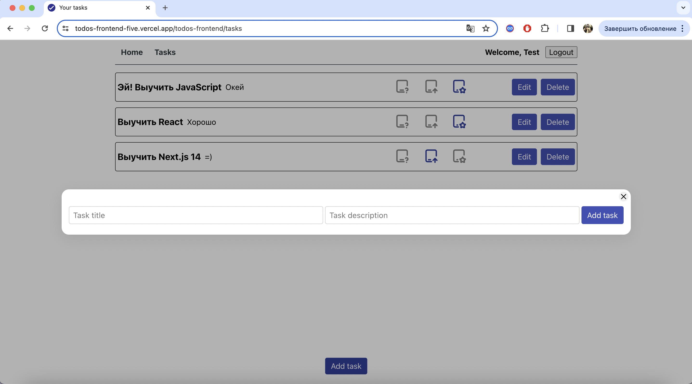
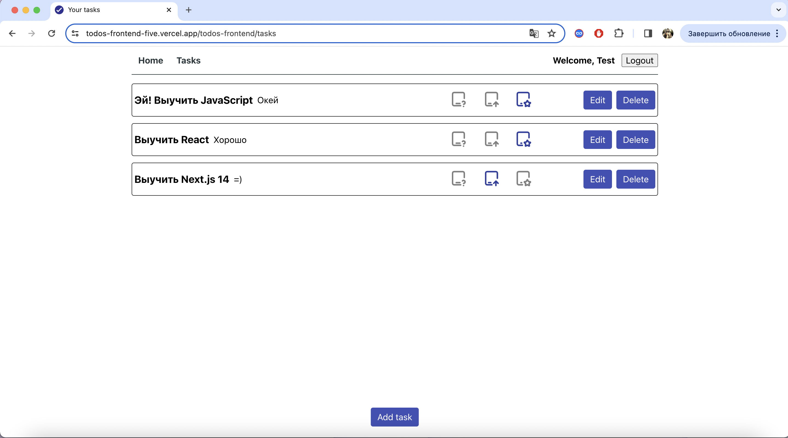
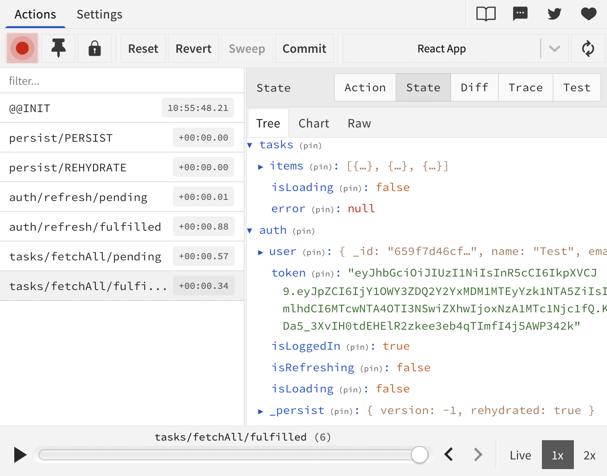

# Todo App

[Todo App](https://todos-frontend-five.vercel.app/todos-frontend/) создано для
безопасного управления задачами, используя систему аутентификации для надежного
хранения информации о пользователях.

## Веб-сервис может находится в состоянии сна, пожалуйста, дайте ему минутку на пробуждение..

## Описание проекта

Проект предоставляет мощный функционал для эффективного управления вашими
задачами. Вам доступны возможности сохранения новых задач, редактирования
существующих, изменения их статусов и, конечно, удаления.

Что делает этот проект особенно ценным, так это его встроенная интеграция с
веб-сервером. Ваши задачи надежно сохраняются и доступны вам в любой момент,
обеспечивая стабильность и надежность в управлении вашим рабочим процессом.

### Особенности

- **Управление задачами:** Простое добавление, редактирование и удаление задач.
- **Безопасность с аутентификацией:** Использует аутентификацию для хранения
  персональных данных пользователей.
- **Взаимодействие с пользователем:** В отсутствие задач отображается
  текст-заглушка, призывающий пользователей добавить новые задачи.
- **Модальное окно для добавления задач:** Добавление задач осуществляется с
  помощью модального окна, созданным с использованием `createPortal` из
  библиотеки `react-dom`, что позволяет не волноваться о его перекрытии другим
  контентом. 
- **Варианты статуса задачи:** Задачи по умолчанию имеют статус "в ожидании",
  который легко изменить с помощью соответствующих значков на "выполнено" или "в
  процессе".

- **Удобство пользователя:** Пользователя информирует лоадер о взаимодействии
  клиента с веб-сервером. По завершении операции, пользователь получает
  уведомление о результате, будь то успешное или неудачное добавление задачи.
  Кнопка "edit" позволяет легко изменить заголовок и описание задачи. При
  нажатии, поля автоматически заполняются существующей информацией, а процесс
  аналогичен добавлению новой задачи. Удаление задачи также реализовано,
  предоставляя пользователям уверенность в управлении своим списком дел.
  

  При обновлении страницы пользователь видит лоадер, а клиентская часть
  приложения связывается с сервером для проверки валидности JWT токена. В случае
  валидности токена, пользователь остается авторизованным на странице с
  задачами. В противном случае, происходит перенаправление на страницу
  авторизации.

   Redux-persist позволяет в течение
  суток оставаться авторизованным, что избавляет от лишних хлопот.

## Используемые технологии

- TypeScript
- React
- Redux
- Redux Toolkit

## Установка

Для установки и запуска проекта выполните следующие шаги:

```bash
# Клонировать репозиторий
git clone https://github.com/NikitaSimakov/todos-frontend.git

# Перейти в директорию проекта
cd ваш-репозиторий

# Установить зависимости
npm install

# Запустить приложение в режиме разработки
npm start
```
